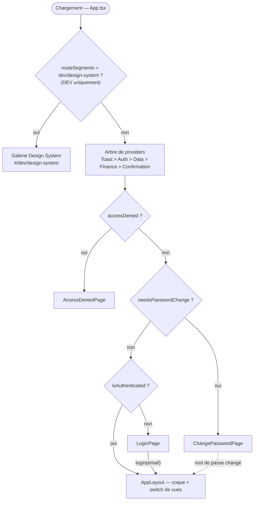
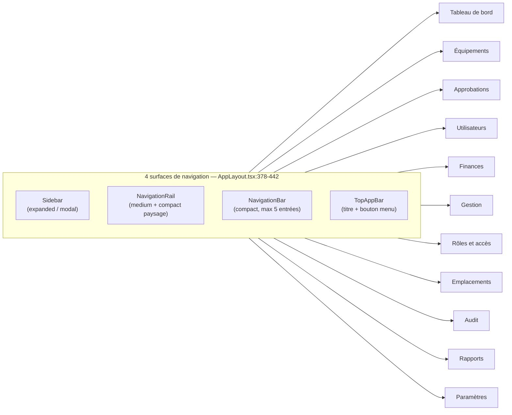
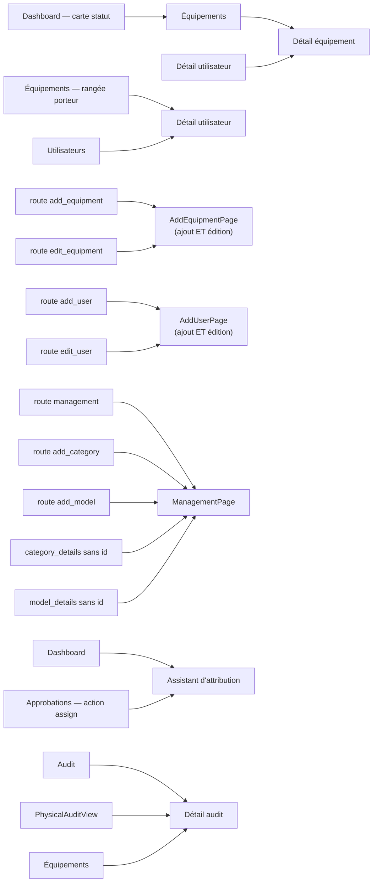
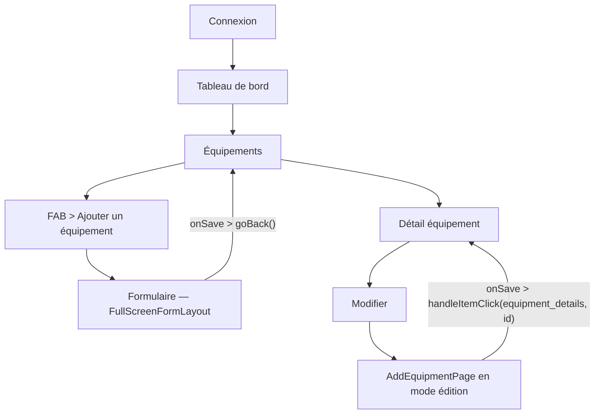
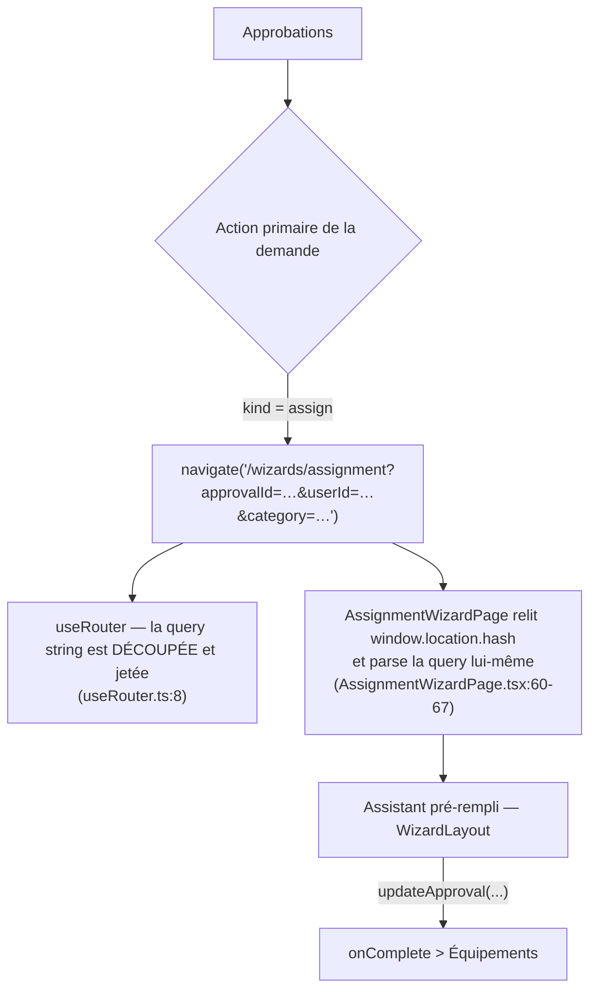
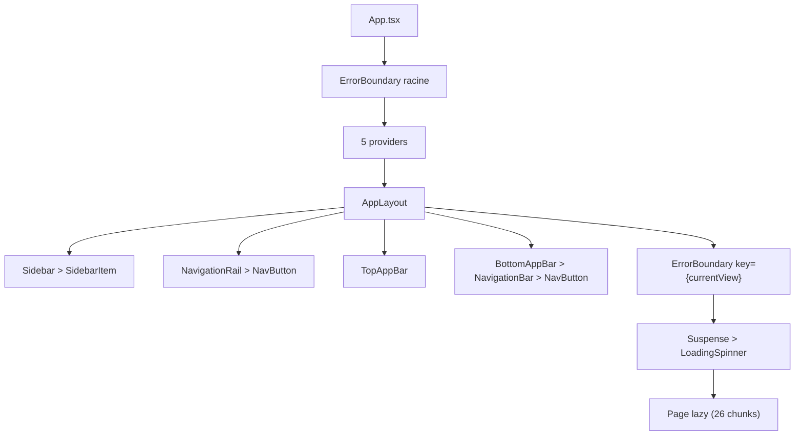
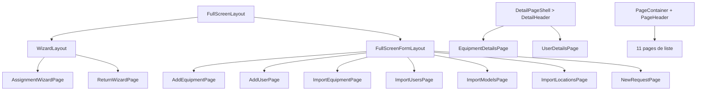

# UI_FLOW_MAP.md — cartographie de l'architecture de navigation

**Projet** : Neemba Tracker · **Date du relevé** : 2026-08-03 · **Branche** : `feat/tracker-ds-namespace`

Document unique reconstruit **à partir du code source**, sans supposition. Chaque affirmation
renvoie au fichier et à la ligne qui la porte.

---

## 0. Cadre technique réel

La demande initiale citait des constructions Flutter (`Navigator`, `GoRouter`, `AutoRoute`,
`ElevatedButton`, `InkWell`, `Drawer`, `NavigationRail`, `SpeedDial`). **Aucune n'existe ici.**
Le projet est un SPA **React 19 + TypeScript + Vite 6**. La cartographie porte donc sur les
constructions réellement présentes :

| Concept demandé | Équivalent réel dans ce projet | Fichier |
| --- | --- | --- |
| Router / GoRouter | Routeur de **hash** fait main | `src/hooks/useRouter.ts` |
| Named routes | Union de types `ViewType` + 2 tables de correspondance | `src/hooks/useAppNavigation.ts` |
| RouterDelegate | `switch (currentView)` avec `React.lazy` | `src/components/layout/AppLayout.tsx:208` |
| NavigationService | Prop drilling `onViewChange` + hook `useAppNavigation` | *(les deux coexistent — voir §7.4)* |
| Deep links | Hash `#/section/action/param` | `useRouter.ts:5-10` |
| Drawer / NavigationRail / BottomNavigationBar | `Sidebar` / `NavigationRail` / `NavigationBar` | `src/components/layout/` |
| FloatingActionButton / SpeedDial | `ListActionFab`, `FloatingActionButton`, `FabContainer` | `src/components/ui/` |
| Dialog / BottomSheet | `Modal`, `SideSheet`, `BottomSheet`, `ConfirmationDialog` | `src/components/ui/` |

**React Router n'est pas une dépendance** (contrairement à ce qu'annoncent `README.md` et
`AGENTS.md`, tous deux périmés sur ce point).

### Couverture de l'analyse

| Lu intégralement | Relevé par recherche ciblée |
| --- | --- |
| `App.tsx`, `useRouter.ts`, `useAppNavigation.ts`, `AppLayout.tsx`, `destinations.ts` | Les 31 pages, les 6 composants de feature, les 38 primitives `ui/`, les 15 fichiers `layout/` |

Les relations listées sont celles **effectivement câblées dans le code**. Les composants dont je
n'ai relevé que les imports et les appels de navigation sont signalés comme tels.

---

## 1. UI Flow Map — cartographie globale

### 1.1 Portes d'entrée (avant la coque applicative)

`App.tsx` monte **quatre écrans hors coque**, dans cet ordre de priorité (`App.tsx:33-58`) :



> **La galerie est montée AVANT les providers et AVANT la porte d'authentification**
> (`App.tsx:62-75`). C'est délibéré et commenté : outil de conception, consultable sans session,
> et le `import()` est placé dans la condition pour que le chunk disparaisse en production.

### 1.2 Coque applicative et destinations



**Répartition des surfaces** (`AppLayout.tsx:58-63`, `104-115`) :

| Surface | Condition d'affichage | Destinations portées |
| --- | --- | --- |
| `Sidebar` | toujours montée ; mode modal si `!isExpandedUp` | **les 11** (`Sidebar.tsx:282-394`) |
| `NavigationRail` | `isMedium \|\| (isCompact && isLandscape)` | 4 primaires + menu (`NavigationRail.tsx:78-96`) |
| `NavigationBar` | `isCompact && !paysage && vue ∈ bottomNavViews` | 4 primaires + « Plus » (`NavigationBar.tsx:134-197`) |
| `TopAppBar` | `isCompact && !paysage && vue ∉ adnMobileViews` | aucune — titre + ouverture du menu |

`adnMobileViews = ['audit']` (`AppLayout.tsx:114`) : la vue Audit porte son propre en-tête, la
barre du haut y est supprimée pour éviter le doublon de titre.

### 1.3 Carte détaillée par écran

```
Login
  └── (authentification) → Dashboard

Dashboard  [DashboardPage.tsx]
  ├── Carte statut (x N)      → Équipements filtrés   (/inventory/filter/:status)
  ├── Attribuer               → Assistant d'attribution
  ├── Restituer               → Assistant de retour
  ├── Nouvelle demande        → Nouvelle demande
  ├── Approbations            → Approbations
  ├── Audit                   → Audit
  ├── Finances                → Finances
  ├── SecurityGate            → (garde PIN in situ, pas une destination)
  └── TransactionTicketModal  → (SideSheet, pas une destination)

Équipements  [InventoryPage.tsx]
  ├── Rangée équipement       → Détail équipement
  ├── Rangée porteur          → Détail utilisateur
  ├── FAB « Équipement »      → Ajouter un équipement
  ├── Importer                → Importer équipements
  ├── Audit                   → Détail audit
  └── useConfirmation         → (dialogue de suppression)

Détail équipement  [EquipmentDetailsPage.tsx — DetailPageShell]
  ├── Retour                  → Équipements
  ├── Modifier                → Modifier un équipement  (même composant que « Ajouter »)
  └── useConfirmation         → (dialogue)

Utilisateurs  [UsersPage.tsx]
  ├── Rangée                  → Détail utilisateur
  ├── FAB « Utilisateur »     → Ajouter un utilisateur
  ├── Importer                → Importer utilisateurs
  └── useConfirmation         → (dialogue)

Détail utilisateur  [UserDetailsPage.tsx — DetailPageShell + PageTabs]
  ├── Retour                  → Utilisateurs
  ├── Rangée équipement       → Détail équipement
  ├── Modifier                → Modifier utilisateur
  └── useConfirmation         → (dialogue)

Approbations  [ApprovalsPage.tsx — PageTabs + ListActionFab]
  ├── FAB « Demande »         → Nouvelle demande        (navigate('/approvals/new'))
  ├── Action « assign »       → Assistant d'attribution (navigate avec query string)
  └── ApprovalRow > SecurityGate → (garde PIN)

Gestion  [ManagementPage.tsx — PageTabs catégories/modèles]
  ├── Rangée catégorie        → Détail catégorie
  ├── Rangée modèle           → Détail modèle
  ├── FAB (libellé selon onglet) → modale AddCategoryPage / AddModelPage
  ├── Importer modèles        → Importer modèles
  └── useConfirmation         → (dialogue)

Audit  [AuditPage.tsx]
  ├── PhysicalAuditView       → Détail audit
  ├── AuditOverviewMobile     → (BottomSheet, compact)
  └── FAB « Audit »           → Détail audit

Emplacements · Finances · Rôles · Rapports · Paramètres
  └── écrans terminaux : aucune destination sortante routée
      (Finances et Emplacements ouvrent des Modal/SideSheet internes)
```

---

## 2. Cartographie des relations — nœuds convergents

Les écrans atteints depuis plusieurs origines convergent vers **un seul nœud**.



### Écrans mutualisés — synthèse

| Écran cible | Nombre d'origines | Origines | Fichier |
| --- | --- | --- | --- |
| **AddEquipmentPage** | 2 routes | `add_equipment`, `edit_equipment` | `AppLayout.tsx:227-236` |
| **AddUserPage** | 2 routes | `add_user`, `edit_user` | `AppLayout.tsx:256-265` |
| **ManagementPage** | 5 routes | `management`, `add_category`, `add_model`, + replis sans id | `AppLayout.tsx:276-311` |
| **InventoryPage** | 3 routes | `equipment`, + replis `equipment_details`/`edit_equipment` sans id | `AppLayout.tsx:211-236` |
| **UsersPage** | 3 routes | `users`, + replis `user_details`/`edit_user` sans id | `AppLayout.tsx:240-265` |
| **Détail équipement** | 3 origines UI | Inventaire, Détail utilisateur, lien direct | `AppLayout.tsx:215,253` |
| **Détail utilisateur** | 2 origines UI | Utilisateurs, Inventaire (colonne porteur) | `AppLayout.tsx:216,244` |
| **Assistant d'attribution** | 2 origines UI | Dashboard, Approbations | `DashboardPage`, `ApprovalsPage.tsx:177` |
| **Détail audit** | 3 origines UI | AuditPage, PhysicalAuditView, InventoryPage | *(appels `onViewChange('audit_details')`)* |

---

## 3. Cartographie des workflows

### 3.1 Cycle de vie d'un équipement



> **Asymétrie relevée** : après un **ajout**, `onSave` appelle `goBack()` → retour à la liste
> (`AppLayout.tsx:228`). Après une **édition**, `onSave` renvoie à la **fiche**
> (`AppLayout.tsx:234`). Même bouton, même formulaire, deux atterrissages.

### 3.2 Attribution depuis une demande approuvée



> Le passage de paramètres se fait **hors du routeur**. `useRouter` supprime la query
> (`path.split('?')`), `useAppNavigation` ne l'expose jamais ; seul le wizard la récupère en
> relisant `window.location.hash` directement. Canal fonctionnel mais invisible à la couche
> de routage — voir §7.4.

### 3.3 Restitution

```
Tableau de bord → Restituer → ReturnWizardPage (WizardLayout)
                                   ├── onCancel   → Équipements
                                   └── onComplete → Équipements
```

### 3.4 Cycle utilisateur

```
Connexion → Utilisateurs → FAB → Ajouter un utilisateur → onSave → goBack() → Utilisateurs
                        → Rangée → Détail utilisateur → Modifier → AddUserPage(userId)
                                                                  → onSave → Détail utilisateur
                        → Détail utilisateur → rangée équipement → Détail équipement
```

### 3.5 Import en masse (4 parcours identiques dans leur forme)

```
Équipements  → Importer → ImportEquipmentPage  ┐
Utilisateurs → Importer → ImportUsersPage      ├── FileDropzone → aperçu → validation → onSave
Gestion      → Importer → ImportModelsPage     │
Emplacements → Importer → ImportLocationsPage  ┘
```

**Deux de ces quatre parcours sont cassés** — voir §7.1.

### 3.6 Audit physique

```
Audit → PhysicalAuditView / AuditOverviewMobile (BottomSheet en compact)
      → Détail audit (SideSheet + PageTabs + useConfirmation)
      → onBack → Audit
```

### 3.7 Demande d'équipement

```
Tableau de bord ─┐
                 ├→ Nouvelle demande (FullScreenFormLayout) → Approbations
Approbations ────┘
```

---

## 4. Cartographie des composants

### 4.1 Coque



> Le `key={currentView}` sur le boundary par vue (`AppLayout.tsx:425`) est ce qui permet de
> sortir d'une page plantée sans recharger : sans lui, la vue resterait cassée à vie.

### 4.2 Coques de page (4 gabarits)



### 4.3 Décomposition d'une page de liste (modèle récurrent)

```
InventoryPage / UsersPage / LocationsPage / ManagementPage / ApprovalsPage
  ├── PageContainer
  ├── PageHeader
  ├── SearchFilterBar  (+ SelectFilter)
  ├── PageTabs         (Approbations, Gestion)
  ├── EntityRow / Card / TableScrollArea
  ├── StatusBadge · Badge · Chip · UserAvatar · MaterialIcon
  ├── Pagination
  ├── EmptyState
  ├── ListActionFab    (FAB de création)
  └── useConfirmation  (suppression)
```

---

## 5. Matrice de navigation

Colonnes : origine → composant → action → destination → workflow → composant partagé → observation.

| Origine | Composant | Action | Destination | Workflow | Partagé | Observation |
| --- | --- | --- | --- | --- | --- | --- |
| Sidebar / Rail / BottomBar | `NavButton` | clic destination | 11 sections | Navigation globale | `DESTINATIONS` | Registre unique, OK |
| LoginPage | `Button` | Se connecter | Dashboard | Authentification | — | `App.tsx:48` |
| Dashboard | carte statut | clic | `equipment` + filtre | Consultation | `onNavigate` | Seul usage de `onNavigate` (`DashboardPage.tsx:317`) |
| Dashboard | `Button` | Attribuer | `assignment_wizard` | Attribution | `WizardLayout` | — |
| Dashboard | `Button` | Restituer | `return_wizard` | Restitution | `WizardLayout` | — |
| Dashboard | `Button` | Nouvelle demande | `new_request` | Demande | `FullScreenFormLayout` | — |
| Dashboard | `TransactionTicketModal` | ouvrir ticket | *(SideSheet)* | Consultation | `SideSheet` | Un seul appelant |
| Dashboard | `SecurityGate` | garde PIN | *(in situ)* | Sécurité | `SecurityGate` | Aussi dans `ApprovalRow` |
| Équipements | `EntityRow` | clic rangée | `equipment_details` | Cycle équipement | **convergent** | `AppLayout.tsx:215` |
| Équipements | rangée porteur | clic | `user_details` | Cycle utilisateur | **convergent** | `AppLayout.tsx:216` |
| Équipements | `ListActionFab` | + Équipement | `add_equipment` | Création | `FullScreenFormLayout` | — |
| Équipements | `Button` | Importer | `import_equipment` | Import | `FullScreenFormLayout` | **cassé — §7.1** |
| Détail équipement | `Button` | Modifier | `edit_equipment` | Édition | `AddEquipmentPage` | Retour ≠ retour d'ajout |
| Détail équipement | `DetailPageShell` | Retour | `equipment` | — | `DetailPageShell` | — |
| Utilisateurs | `EntityRow` | clic | `user_details` | Cycle utilisateur | **convergent** | — |
| Utilisateurs | `ListActionFab` | + Utilisateur | `add_user` | Création | `FullScreenFormLayout` | — |
| Utilisateurs | `Button` | Importer | `import_users` | Import | `FullScreenFormLayout` | **cassé — §7.1** |
| Détail utilisateur | rangée équipement | clic | `equipment_details` | Cycle équipement | **convergent** | `AppLayout.tsx:253` |
| Approbations | `ListActionFab` | + Demande | `new_request` | Demande | `FullScreenFormLayout` | `navigate()` brut |
| Approbations | action « assign » | valider | `assignment_wizard` | Attribution | `WizardLayout` | Query hors routeur — §7.4 |
| Gestion | `EntityRow` | catégorie | `category_details` | Catalogue | — | — |
| Gestion | `EntityRow` | modèle | `model_details` | Catalogue | — | — |
| Gestion | `ListActionFab` | + (selon onglet) | modale in situ | Catalogue | `Modal` | `AddCategoryPage`/`AddModelPage` |
| Gestion | `Button` | Importer modèles | `import_models` | Import | `FullScreenFormLayout` | Contrat correct |
| Emplacements | `ListActionFab` | + Emplacement | modale in situ | Emplacements | `Modal` | Écran terminal |
| Emplacements | `Button` | Importer | `import_locations` | Import | `FullScreenFormLayout` | Contrat correct |
| Audit | `ListActionFab` | Audit | `audit_details` | Audit | — | id jamais transmis — §7.3 |
| Détail audit | `Button` | Retour | `audit` | Audit | — | — |
| Paramètres | `Button` | Déconnexion | LoginPage | Authentification | `onLogout` | Seule page recevant `onLogout` |
| Toutes listes | `useConfirmation` | supprimer | *(dialogue)* | Suppression | `ConfirmationDialog` | 9 appelants |

---

## 6. Shared Components

### 6.1 Coques et conteneurs

| Composant | Appelants | Rôle |
| --- | --- | --- |
| `FullScreenLayout` | `WizardLayout`, `FullScreenFormLayout` | Base des deux gabarits plein écran |
| `FullScreenFormLayout` | **7 pages** | Formulaires et imports |
| `WizardLayout` | **2 pages** | Assistants attribution / retour |
| `DetailPageShell` (+ `DetailHeader`) | **2 pages** | Fiches équipement et utilisateur |
| `PageContainer` / `PageHeader` | **11 fichiers** | Toutes les listes |

### 6.2 Primitives les plus mutualisées

| Primitive | Fichiers importateurs (hors galerie) |
| --- | --- |
| `MaterialIcon` | 43 |
| `Button` | 38 |
| `InputField` / `Badge` | 15 |
| `SelectField` | 14 |
| `PageTabs` | 10 |
| `SearchFilterBar` | 9 |
| `IconButton` / `TextArea` / `EmptyState` | 8 |
| `ListActionFab` / `FileDropzone` / `DemoBadge` | 7 |

### 6.3 Surfaces superposées

| Surface | Appelants |
| --- | --- |
| `Modal` | `AddBudgetModal`, `AddExpenseModal`, `FinanceManagementPage`, `LocationsPage`, `AddCategoryPage`, `AddModelPage` |
| `SideSheet` | `TransactionTicketModal`, `SecurityGate`, `AuditDetailsPage`, `FinanceManagementPage` |
| `BottomSheet` | `AuditOverviewMobile` **(1 seul)** |
| `ConfirmationDialog` via `useConfirmation` | 9 pages |

### 6.4 Services et gardes partagés

| Élément | Appelants | Rôle |
| --- | --- | --- |
| `useAccessControl` → `permissions.*` | `AppLayout`, 3 surfaces de nav, pages | Filtrage RBAC |
| `useConfirmation` | 9 pages | Confirmation impérative |
| `SecurityGate` | `ApprovalRow`, `DashboardPage` | Garde PIN avant acte sensible |
| `useMediaQuery` + `MEDIA` | `AppLayout` et pages compactes | Bascule de coque |
| `ErrorBoundary` | racine, par vue, galerie | Filet |

---

## 7. Audit UX / UI — incohérences relevées

### 7.1 🔴 CRITIQUE — deux parcours d'import sont cassés à l'exécution

`ImportEquipmentPage` et `ImportUsersPage` déclarent **deux props requises** :

```ts
interface ImportEquipmentPageProps { onCancel: () => void; onSave: () => void; }
```
`ImportEquipmentPage.tsx:12-15` · `ImportUsersPage.tsx:12-15`

`AppLayout` ne leur passe **ni l'une ni l'autre** — il passe `onViewChange`, une prop qui
n'existe pas dans leur contrat :

```tsx
case 'import_equipment': return <ImportEquipmentPage onViewChange={handleViewChange} />;   // :238
case 'import_users':     return <ImportUsersPage      onViewChange={handleViewChange} />;   // :267
```

**Conséquences** : `onCancel` est transmis à `FullScreenFormLayout` (`:138` / `:139`) → le clic
sur « Annuler » appelle `undefined()`. Et `onSave()` est appelé **après un import réussi**
(`:125` / `:126`) → l'utilisateur perd l'écran juste après avoir validé son fichier.

**Pourquoi ce n'est pas détecté** : `"build": "vite build"` (`package.json:9`) ne fait
**aucune vérification de types** — esbuild transpile sans `tsc`. Et `eslint src` n'est pas
type-aware. Les deux autres imports (`ImportModelsPage`, `ImportLocationsPage`) reçoivent
correctement `onCancel`/`onSave` (`AppLayout.tsx:313,318`) : le contrat n'est donc pas ambigu,
il est juste violé à deux endroits.

### 7.2 🔴 CRITIQUE — deux routes rendent silencieusement le Dashboard

Dans le parseur (`useAppNavigation.ts:75-85`), `computedView` est initialisé à `'dashboard'`
(`:46`) puis :

```ts
} else if (section === 'management') {
    if (action === 'categories') {
        if (param === 'add') computedView = 'add_category';
        else if (param) { computedView = 'category_details'; id = param; }
        // ← aucun else : computedView reste 'dashboard'
    } else if (action === 'models') {
        // ← même trou
    } else { computedView = 'management'; }
}
```

`#/management/categories` et `#/management/models` (sans troisième segment) affichent donc le
**tableau de bord**, avec une URL qui annonce la gestion. Aucune des deux n'est produite par
l'interface, mais toutes deux sont des URL plausibles à la main ou en favori.

### 7.3 🟠 HAUTE — le paramètre de `audit_details` est mort

`navigateToItem` sait fabriquer `/audit/details/:id` (`useAppNavigation.ts:160`), mais le
parseur de la section `audit` (`:91-94`) **n'assigne jamais `id`**, et `AppLayout` monte
`AuditDetailsPage` **sans prop d'identifiant** (`:322-328`). L'id circule dans l'URL et n'est
lu par personne.

### 7.4 🟠 HAUTE — trois mécanismes de navigation coexistent

| Mécanisme | Fichiers | Problème |
| --- | --- | --- |
| Prop drilling `onViewChange` | Dashboard, Inventory, Users, Management, Audit… | Passe par `routeMap`, typé |
| `useAppNavigation().navigate('/chemin')` | **7 fichiers** : `ApprovalsPage`, `NewRequestPage`, `PhysicalAuditView`, `EquipmentDetailsPage`, `LocationsPage`, `RbacPage`, `UserDetailsPage` | Chaînes brutes, hors `routeMap` : un renommage de route ne les casse pas à la compilation |
| Query string relue via `window.location.hash` | `AssignmentWizardPage.tsx:60-67` | Canal invisible au routeur (`useRouter.ts:8` jette la query) |

Trois façons d'aller au même endroit, dont deux échappent à la table de routes.

### 7.5 🟠 HAUTE — le Tableau de bord est gaté par une permission d'inventaire

Les **trois** surfaces de navigation conditionnent l'entrée « Tableau de bord » à
`permissions.canViewInventory` :

- `Sidebar.tsx:282` — `{!hidePrimary && permissions.canViewInventory && (…dashboard + equipment…)}`
- `NavigationRail.tsx:79` — `...(permissions.canViewInventory ? [{ id: 'dashboard' … }] : [])`
- `NavigationBar.tsx:145` — `if (permissions.canViewInventory) { items.push({ id: 'dashboard' …`

Or `canAccessView('dashboard')` retourne `true` (`AppLayout.tsx:191`, cas par défaut) et `/` est
la **route par défaut** (`useAppNavigation.ts:46`). Un profil sans `canViewInventory` atterrit
donc sur un écran que plus aucune navigation ne référence — il ne peut plus y revenir.

### 7.6 🟡 MOYENNE — deux tables de libellés divergentes pour les mêmes vues

`VIEW_TITLES` (titre du document, `useAppNavigation.ts:6-38`) et `getTopAppBarTitle` (barre du
haut, `AppLayout.tsx:117-152`) sont deux tables parallèles. **15 vues sur 30 divergent** :

| Vue | Titre du document | Barre du haut |
| --- | --- | --- |
| `equipment_details` | Détails équipement | Détail équipement |
| `user_details` | Détails utilisateur | **Profil utilisateur** |
| `add_equipment` | Ajouter un équipement | Équipement |
| `edit_equipment` | Modifier un équipement | Équipement |
| `import_equipment` | Importer équipements | Import équipements |
| `add_user` | Ajouter un utilisateur | Utilisateur |
| `edit_user` | Modifier utilisateur | Utilisateur |
| `import_users` | Importer utilisateurs | Import utilisateurs |
| `category_details` | Détails catégorie | Détail catégorie |
| `model_details` | Détails modèle | Détail modèle |
| `import_models` | Importer modèles | Import modèles |
| `import_locations` | Importer **localisations** | Import **emplacements** |
| `assignment_wizard` | Assistant d'attribution | Attribution |
| `return_wizard` | Assistant de retour | Retour |
| `audit_details` | Détails audit | Détail audit |

Le cas `import_locations` est le plus net : deux **noms métier différents** pour le même objet,
alors que `src/constants/glossary.ts` est déclaré source unique de terminologie
(`DESIGN_SYSTEM.md` §13).

### 7.7 🟡 MOYENNE — trois écrans, un bouton « Modifier », deux atterrissages

Le formulaire est bien **un seul composant** (`AddEquipmentPage`, `AddUserPage`) : la
mutualisation demandée est respectée. Mais le retour diffère selon la porte d'entrée :

| Route | `onSave` | `onCancel` |
| --- | --- | --- |
| `add_equipment` | `goBack()` → liste | `goBack()` → liste |
| `edit_equipment` | `handleItemClick('equipment_details', id)` → fiche | idem |

Même écran, même bouton « Enregistrer », deux destinations. Idem côté utilisateur
(`AppLayout.tsx:257,262-264`).

### 7.8 🟡 MOYENNE — `goBack()` ne connaît que 5 sections

`useAppNavigation.ts:168-176` traite `inventory`, `users`, `management`, `audit`, et
`approvals/new`. **Tout le reste retombe sur `/`** : les wizards, `rbac`, `locations`,
`reports`, `finance`, `settings`. Un « retour » depuis `/locations/import` ramène au tableau de
bord, pas aux emplacements.

### 7.9 🟡 MOYENNE — contrats de page hétérogènes

| Forme du contrat | Pages |
| --- | --- |
| `onViewChange` | Dashboard, Inventory, Users, Management, Audit, AuditDetails, ImportEquipment*, ImportUsers* |
| `onCancel` + `onSave` | AddEquipment, AddUser, ImportModels, ImportLocations |
| `onBack` | EquipmentDetails, UserDetails, CategoryDetails, ModelDetails |
| `onCancel` + `onComplete` | AssignmentWizard, ReturnWizard |
| aucun prop | Approvals, Finance, Rbac, Locations, Reports |
| `onLogout` | Settings |

Six conventions pour un même besoin. C'est la cause racine de §7.1.

### 7.10 🟢 FAIBLE — un second écran 404 mort

`AppLayout.tsx:364-374` porte un `default:` « Vue non trouvée » **en plus** du cas
`not_found` (`:350-362`). Tous les membres de `ViewType` étant traités par le `switch`, cette
branche est inatteignable — deux écrans d'erreur maintenus pour un seul cas réel.

---

## 8. Plan de standardisation

### Critique

1. **Corriger les deux imports cassés.** Passer `onCancel`/`onSave` à `ImportEquipmentPage` et
   `ImportUsersPage` dans `AppLayout.tsx:238,267`, sur le modèle déjà correct de
   `ImportModelsPage` (`:313`).
2. **Ajouter `tsc --noEmit` au build et à la CI.** C'est la seule raison pour laquelle §7.1 a
   pu vivre : `vite build` ne type-vérifie rien. Un `"typecheck": "tsc --noEmit"` branché dans
   `lint:ds` aurait bloqué la PR.
3. **Fermer les deux routes qui rendent le Dashboard** (`useAppNavigation.ts:76-82`) : ajouter
   un `else { computedView = 'management'; }` dans chaque branche, ou basculer en `not_found`.

### Haute

4. **Un seul mécanisme de navigation.** Supprimer les `navigate('/chemin')` bruts des 7
   fichiers concernés au profit de `navigateToView` / `navigateToItem`, et exposer les
   paramètres de query dans `useAppNavigation` plutôt que de les faire relire à la main par
   `AssignmentWizardPage`.
5. **Décider du sort de `audit_details` + id** : soit le parseur extrait `id = param` et la page
   le consomme, soit `navigateToItem` cesse de proposer cette entrée.
6. **Découpler le Tableau de bord de `canViewInventory`** dans les trois surfaces de navigation.

### Moyenne

7. **Fusionner les deux tables de libellés** en une seule, alimentée par `DESTINATIONS` et
   `GLOSSARY` — ce qui règle du même coup les 14 divergences et le conflit
   « localisations / emplacements ».
8. **Un contrat de page unique.** Trois formes suffisent : `onViewChange` (listes),
   `onCancel`/`onSave` (formulaires), `onBack` (détails). Aligner les 6 conventions actuelles.
9. **Aligner l'atterrissage après enregistrement** : ajout → liste, édition → fiche, ou l'inverse,
   mais la même règle sur les deux domaines et écrite dans `DESIGN_SYSTEM.md` §12.
10. **Compléter `goBack()`** pour les 6 sections non traitées.

### Faible

11. Supprimer le `default:` mort d'`AppLayout` (§7.10).
12. Supprimer le dossier vide `src/routes/`.
13. Déplacer `AddCategoryPage` / `AddModelPage` hors de `pages/` : ce sont des modales montées
    par `ManagementPage`, pas des pages routées.
14. Statuer sur `Divider` (aucun appelant applicatif).

---

## 9. Analyse des orphelins

### 9.1 Routes et vues

| Élément | État | Détail |
| --- | --- | --- |
| `src/routes/` | **Dossier vide** | Vestige — aucun fichier |
| `not_found` | Sans entrée dans `routeMap` | Atteignable uniquement par URL inconnue ; conforme, mais aucun lien UI |
| `default:` d'`AppLayout` | **Code mort** | Tous les `ViewType` sont couverts par le `switch` |
| `#/management/categories` | **Route piège** | Rend le Dashboard (§7.2) |
| `#/management/models` | **Route piège** | Idem |
| `/audit/details/:id` | **Paramètre mort** | Généré, jamais lu (§7.3) |
| `#/dev/design-system` | Hors coque, DEV seulement | Volontaire et documenté (`App.tsx:19-31`) |

### 9.2 Composants

| Composant | État |
| --- | --- |
| `ui/Divider` | **0 importateur** hors galerie |
| `ui/BottomSheet` | 1 appelant (`AuditOverviewMobile`) |
| `ui/FloatingActionButton`, `ui/FabContainer`, `ui/Menu`, `ui/Snackbar`, `ui/Toggle`, `ui/ConfirmationDialog` | 1 appelant chacun hors galerie — surface d'API large pour un usage unique |
| `AddCategoryPage`, `AddModelPage` | Dans `pages/` mais jamais montés par le routeur — modales de `ManagementPage` (`AppLayout.tsx:284-295`) |
| `src/components/layout/Navigation/` | **Dossier vide** |

### 9.3 Boutons sans destination / destinations sans origine

| Cas | Constat |
| --- | --- |
| Boutons sans destination | Aucun bouton de navigation sans cible identifiée. **Mais** « Annuler » et « Enregistrer » des deux imports cassés pointent vers `undefined` (§7.1) — le symptôme est identique côté utilisateur |
| Destinations sans origine UI | `not_found` (par construction) ; `edit_equipment` / `edit_user` n'ont d'origine que le bouton « Modifier » des fiches |
| Boucles de navigation | Aucune détectée. Les seuls cycles sont volontaires (liste ⇄ détail ⇄ édition) |
| Écrans terminaux | `Finances`, `Rôles`, `Rapports`, `Emplacements`, `Paramètres` : aucune sortie routée, uniquement des surfaces internes (Modal / SideSheet) |

---

## 10. Ce qui n'a pas pu être vérifié

Par honnêteté de relevé :

- Les **variantes visuelles** (spacing, padding, typographie, couleurs, transitions) entre
  écrans censés être identiques n'ont pas été comparées au pixel : la comparaison demanderait
  un run de capture (`npm run qa:visual:auto`). La mutualisation a été vérifiée
  **structurellement** — même composant, mêmes props — ce qui garantit l'identité de rendu
  pour `AddEquipmentPage` et `AddUserPage`.
- Les **écarts de validation de formulaire** entre les 4 parcours d'import n'ont pas été
  diffés ligne à ligne ; seuls les contrats de props l'ont été.
- L'analyse porte sur le code, pas sur l'exécution : les défauts §7.1 et §7.2 sont déduits de la
  lecture et non observés dans le navigateur.
