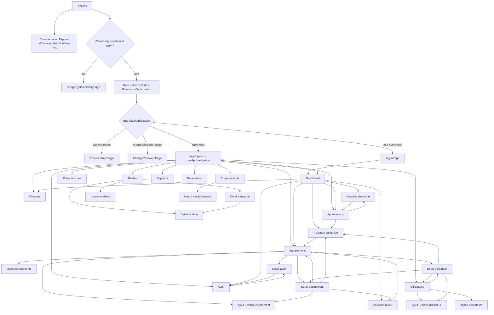
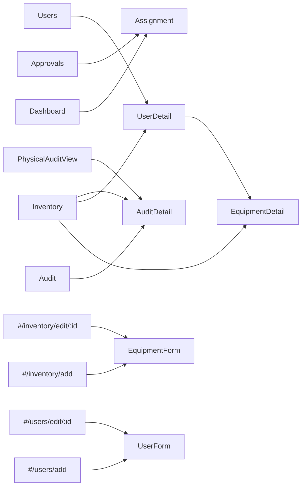

# UI Flow Map

## Périmètre vérifié

Relevé statique du code source du projet, effectué le 2026-08-03. L'application est une SPA React 19 / TypeScript / Vite avec routage par hash interne (`src/hooks/useRouter.ts`), et non une application Flutter. Aucun `Navigator`, `GoRouter`, `AutoRoute`, `Drawer` Flutter, `SpeedDial` ou widget Flutter n'existe dans le dépôt.

Les pages sont sélectionnées par `useAppNavigation`, puis montées de façon lazy par `src/components/layout/AppLayout.tsx`. Les dialogues, feuilles et modales sont des surfaces locales : ils ne changent pas de route.

## Carte globale

## Surfaces de navigation

| Surface | Condition | Couverture |
| --- | --- | --- |
| `Sidebar` | Toujours montée, modale sous `expanded` | 11 destinations |
| `NavigationRail` | Moyen ou compact paysage | 4 destinations principales + menu |
| `NavigationBar` | Compact portrait, vue prise en charge | 4 destinations principales + « Plus » |
| `TopAppBar` | Compact portrait, sauf Audit | Titre + ouverture du menu, pas de destination |

Sources : `AppLayout.tsx`, `Sidebar.tsx`, `NavigationRail.tsx`, `NavigationBar.tsx`, `TopAppBar.tsx`.

## Ecrans mutualisés

Les actions locales ouvrant `Modal`, `SideSheet`, `BottomSheet`, `SecurityGate` ou `ConfirmationDialog` ne sont volontairement pas représentées comme des routes : elles restent dans l'écran d'origine.
