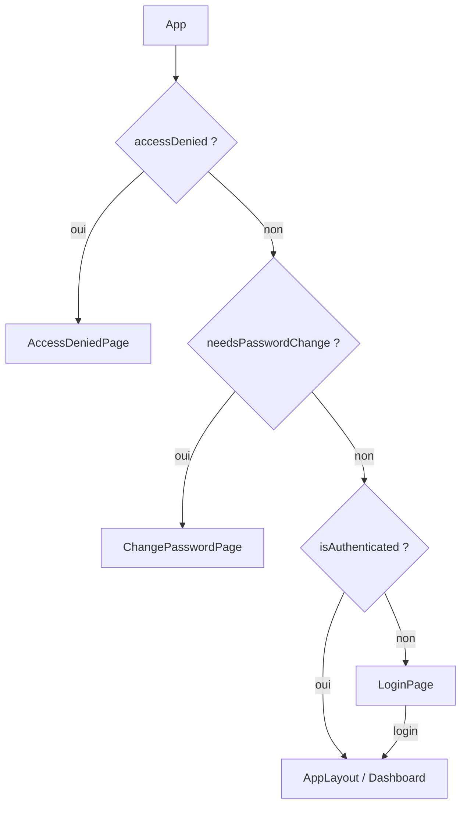
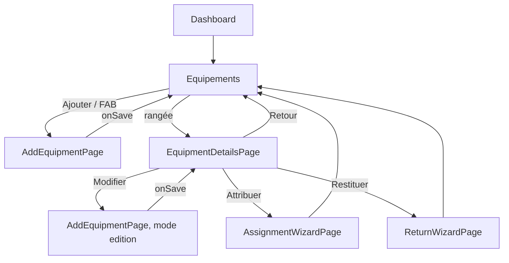
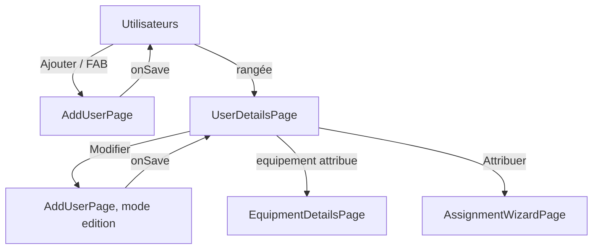
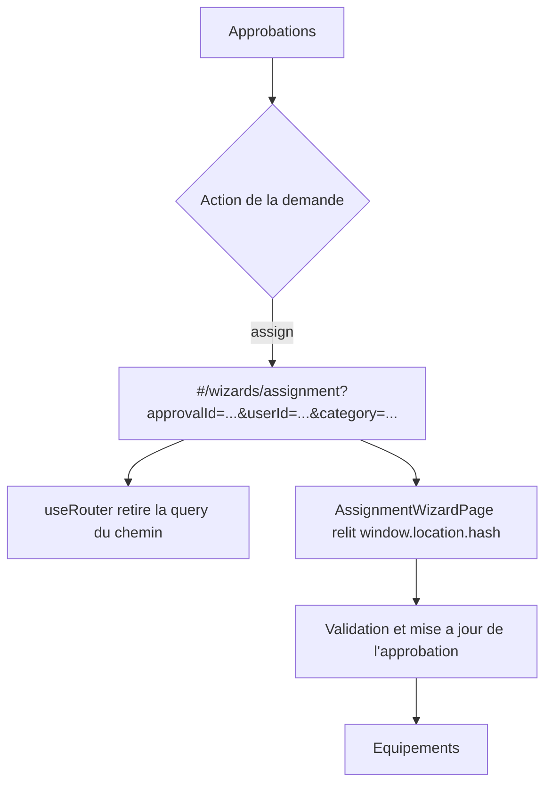
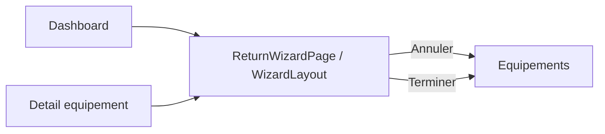
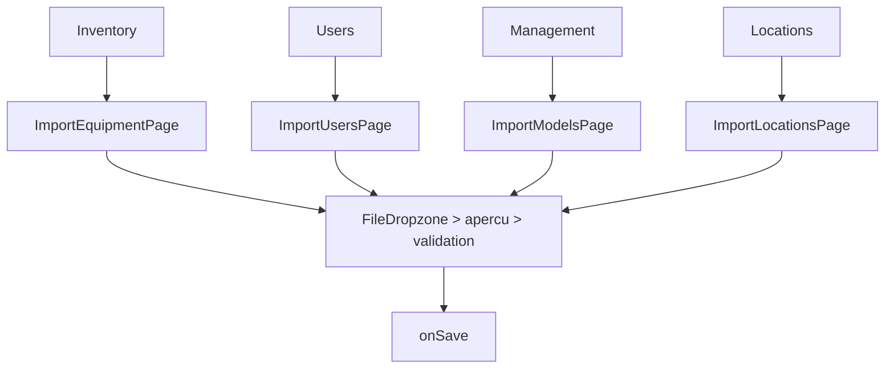
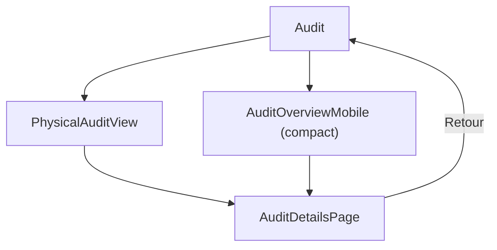

# Workflows

## Authentification

## Cycle de vie équipement

L'asymétrie ajout/édition est réelle : l'ajout revient à la liste, l'édition revient à la fiche (`AppLayout.tsx`).

## Cycle utilisateur

## Approbation vers attribution

Le transfert de paramètres est fonctionnellement séparé du routeur : seul le wizard relit la query (`AssignmentWizardPage.tsx:60-67`).

## Restitution

## Demande d'équipement

## Imports en masse

Les deux premiers parcours n'ont pas le contrat de retour requis au montage ; voir `07-ux-audit.md`.

## Audit physique

