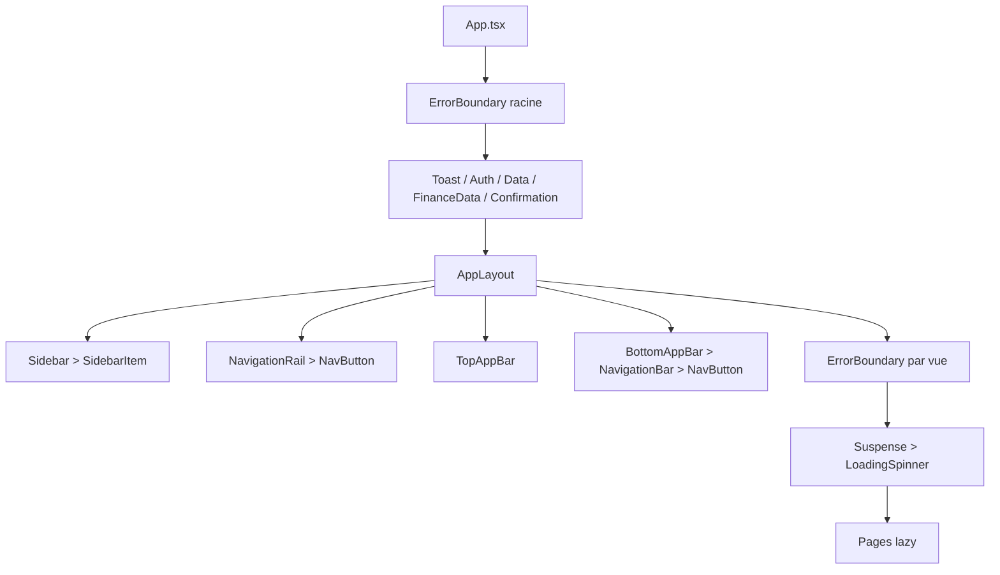
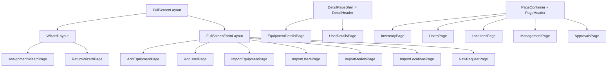
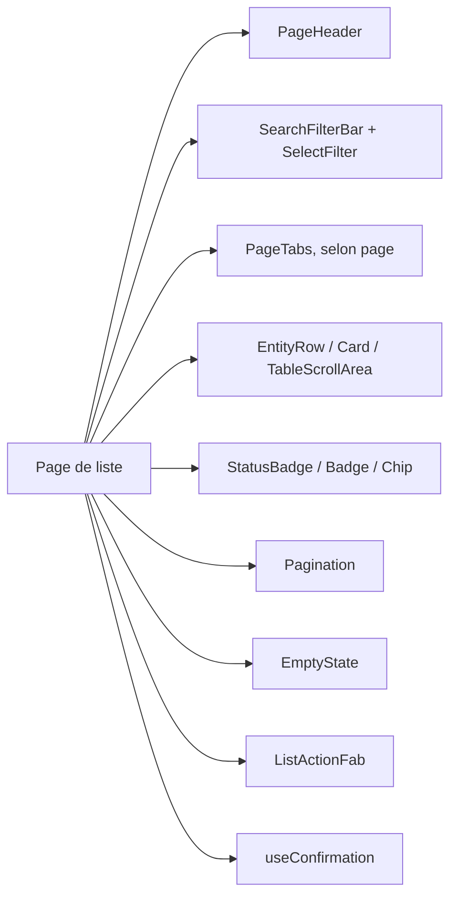

# Components Map

## Arbre de coque

## Gabarits de page

## Structure récurrente de liste

## Dépendances fonctionnelles notables

| Elément | Dépendances / appelants vérifiés |
| --- | --- |
| `SecurityGate` | `DashboardPage`, `ApprovalRow` |
| `TransactionTicketModal` | `DashboardPage` |
| `PhysicalAuditView` | `AuditPage` |
| `AuditOverviewMobile` | `AuditPage`, compact |
| `AddCategoryPage` / `AddModelPage` | `ManagementPage`, modales locales |
| `AddBudgetModal` / `AddExpenseModal` | `FinanceManagementPage` |
| `RbacManagementPanel` | `RbacPage` |

Les arbres indiquent les dépendances structurantes de navigation et de rendu. Les composants de primitives de `src/components/ui` restent des dépendances partagées transverses, détaillées dans `06-shared-components.md`.
