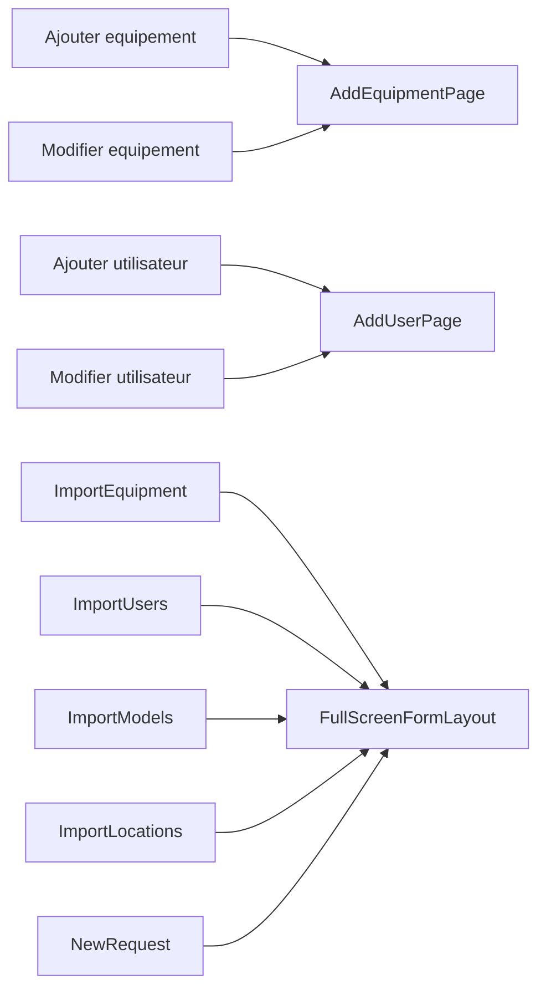

# Shared Components

## Coques et gabarits

| Composant | Appelants vérifiés | Rôle |
| --- | --- | --- |
| `FullScreenLayout` | `WizardLayout`, `FullScreenFormLayout` | base de plein écran |
| `FullScreenFormLayout` | 7 pages | formulaires et imports |
| `WizardLayout` | 2 pages | attribution et restitution |
| `DetailPageShell` + `DetailHeader` | 2 pages | fiches équipement et utilisateur |
| `PageContainer` + `PageHeader` | pages de liste | enveloppe de listes |
| `AppLayout` | application authentifiée | sélection de vue et navigation responsive |

## Primitives les plus réutilisées

| Primitive | Usage observé |
| --- | --- |
| `MaterialIcon` | icônes de navigation, actions et état |
| `Button` | actions de pages, wizards, formulaires |
| `InputField`, `SelectField`, `TextArea` | formulaires |
| `SearchFilterBar`, `SelectFilter` | listes et filtres |
| `PageTabs` | vues à sections, notamment Approbations et Gestion |
| `EntityRow`, `Card`, `TableScrollArea` | listes, détails et résumés |
| `StatusBadge`, `Badge`, `Chip` | états métier |
| `ListActionFab` | création / import depuis liste |
| `FileDropzone` | parcours d'import |
| `EmptyState`, `Pagination` | listes sans données / paginées |

## Surfaces superposées

| Surface | Appelants vérifiés | Statut de navigation |
| --- | --- | --- |
| `Modal` | finance, emplacements, gestion | locale |
| `SideSheet` | ticket transaction, sécurité, audit, finance | locale |
| `BottomSheet` | `AuditOverviewMobile` | locale, compact |
| `ConfirmationDialog` via `useConfirmation` | plusieurs pages | locale |
| `SecurityGate` | Dashboard, `ApprovalRow` | garde locale |

## Services, contextes et helpers structurants

| Elément | Fonction dans l'architecture |
| --- | --- |
| `AuthContext` | session, déconnexion, états d'accès |
| `DataContext` / `FinanceDataContext` | données métier de l'application |
| `ConfirmationContext` | confirmations destructives |
| `ToastContext` | retours utilisateur |
| `useAppNavigation` | conversion URL / vue et retours |
| `useAccessControl` | décision RBAC dans coque et navigation |
| `useMediaQuery` + `MEDIA` | variation Sidebar / Rail / Bottom bar |

## Formulaires mutualisés

