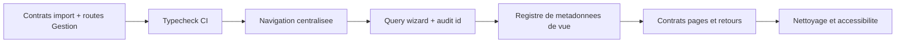

# Standardization Plan

## Critique

1. Corriger le montage de `ImportEquipmentPage` et `ImportUsersPage` dans `AppLayout.tsx` en leur passant `onCancel` et `onSave`, sur le modèle des imports modèles et emplacements.
2. Ajouter `tsc --noEmit` comme script `typecheck` et l'exécuter en CI. `vite build` transpile sans vérifier les contrats TypeScript.
3. Définir explicitement le rendu de `#/management/categories` et `#/management/models` : Gestion ou `not_found`, mais jamais Dashboard implicite.

## Haute

1. Centraliser toutes les destinations dans une API de navigation unique. Remplacer progressivement les `navigate('/...')` bruts par des builders typés pour vue, id et query.
2. Faire porter la query de l'assistant d'attribution par `useAppNavigation`, plutôt que la relire directement dans `AssignmentWizardPage`.
3. Choisir le contrat de `audit_details`: transmettre et consommer l'id, ou retirer la route paramétrée et `navigateToItem`.
4. Découpler l'accès à Dashboard de `canViewInventory` dans Sidebar, Rail et Bottom navigation.

## Moyenne

1. Définir un registre unique de métadonnées de vue : route, titre de document, titre mobile, label navigation et permission. Il remplacera `VIEW_TITLES` et `getTopAppBarTitle`.
2. Normaliser les contrats : liste (`onViewChange`), formulaire (`onCancel/onSave`) et détail (`onBack`), avec les exceptions documentées.
3. Documenter et appliquer une règle d'atterrissage après sauvegarde : création vers liste, édition vers détail, ou une règle différente mais uniforme.
4. Compléter `goBack` avec les parents de toutes les sections concernées.
5. Convertir les `div onClick` de `LocationsPage` en composants interactifs accessibles.

## Faible

1. Retirer le fallback `default` mort d'`AppLayout` s'il est bien couvert par l'union de vues.
2. Déplacer `AddCategoryPage` et `AddModelPage` hors de `pages/` ou documenter leur statut de modales, afin que le nommage ne suggère pas des routes autonomes.
3. Réduire ou documenter les primitives à appelant unique (`Divider`, certaines surfaces UI) après un audit d'API publique.

## Séquençage recommandé

